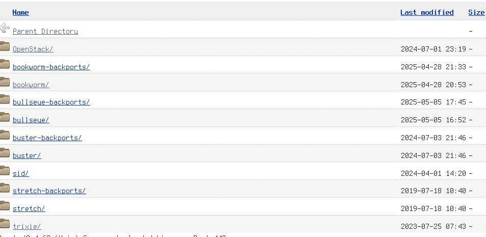

# *httpdirectory*'s readme

This project can interpret correctly roughly 400 debian mirrors in
the wild. It has a coverage percentage above 90%.
Contributions are very welcomed.

## Description

This library provides a convenient way to scrape directory indexes
(like the ones created by `mod_autoindex` with apache or `autoindex`
with nginx) and get a structure that abstracts it. For instance one
may have the following website:



The library will insert in an `HttpDirectory` structure all the
information that is to say, name, link, size and date of files
or directories. Printing it will produce the following output:

```text
https://cloud.debian.org/images/cloud/
DIR       -                    ..
DIR       -  2024-07-01 23:19  OpenStack/
DIR       -  2025-04-28 21:33  bookworm-backports/
DIR       -  2025-04-28 20:53  bookworm/
DIR       -  2025-05-12 23:57  bullseye-backports/
DIR       -  2025-05-12 23:22  bullseye/
DIR       -  2024-07-03 21:46  buster-backports/
DIR       -  2024-07-03 21:46  buster/
DIR       -  2024-04-01 14:20  sid/
DIR       -  2019-07-18 10:40  stretch-backports/
DIR       -  2019-07-18 10:40  stretch/
DIR       -  2023-07-25 07:43  trixie/
```

## Known formats

- simple html `<table>` tables
- `<pre>` formatted tables
- very simple websites containing only `<ul>` and `<il>` tags such as
  the python based server: `python3 -m http.server -b 127.0.0.1 8080`
- [h5ai fallback website](https://github.com/lrsjng/h5ai)
- [OCF adapted nginx flat theme](https://github.com/alehaa/nginx-fancyindex-flat-theme)
- [SNT index generator](https://snt.utwente.nl/en/)
- [miniserve's directory listing](https://crates.io/crates/miniserve)
- [Stil's directory listing](https://crates.io/crates/stil)

## Usage

First obtain a directory from an url using `HttpDirectory::new(url, timeout_s)`
method where url is a `&str` representing the HTTP url and `timeout_s` is an
`Option<u64>` timeout value where `None` is no timeout at all or fix a timeout
in seconds (ie: `Some(30)` for instance). Once done then you can use `dirs()`,
`files()`, `parent_directory()` or `filter_by_name()`, `cd()`, `sort_by_name()`,
`sort_by_date()`, `sort_by_size()` to get respectively all directories, all files,
the `ParentDirectory`, filtering by the name (with a Regex), changing
directory, sorting by name, by date or by size of this `HttpDirectory`
listing entries:

```rust
  use httpdirectory::httpdirectory::HttpDirectory;
  async fn first_example() {
    if let Ok(httpdir) = HttpDirectory::new("https://cloud.debian.org/images/cloud/", Some(30)).await {
        println!("{:?}", httpdir.dirs());
    }
  }
```

In addition you can get some `Stats` about an `HttpDirectory` listing
using `stats` method. It will return a [`Stats`][crate::stats::Stats] structure containing
the number of directories, number of files, total apparent size, the
number of files or directories with a valid date, the number of files
or directories that has no valid dates, the number of parents (that
should always be equal or less than 1)

## Examples

You can see some examples in the example directory:
- [onedir example](https://github.com/dupgit/httpdirectory/tree/master/examples/onedir.rs) for a small example with a
  call to the `cd()` method
- [mirrors example](https://github.com/dupgit/httpdirectory/tree/master/examples/mirrors.rs) that will try to crawl a
  list of 422 debian mirrors and print in red those that were
  possibly not correctly interpreted
- [debug me](https://github.com/dupgit/httpdirectory/tree/master/examples/debug_me.rs) that is used in debugging
  sessions to try to improve the program by being able to interpret
  more websites


## Features

Two features have been introduced to ease tests:
- `test-output` that allows to print the test output when it fails
- `test-helpers` that changes `get_entries_from_body()` function into a public
  one for tests only. Not using this feature for test will fail all tests.

Use those features either with `cargo t --features test-helpers,test-output` or 
`just t`. This also applies to benchmarking: use `cargo bench --features test-helpers` 
or `just b`

One feature is here to help tracking execution time of some annotated functions. Use
it on examples either directly `cargo r --release --example debug_me --features=hotpath`
or `just example debug_me`
